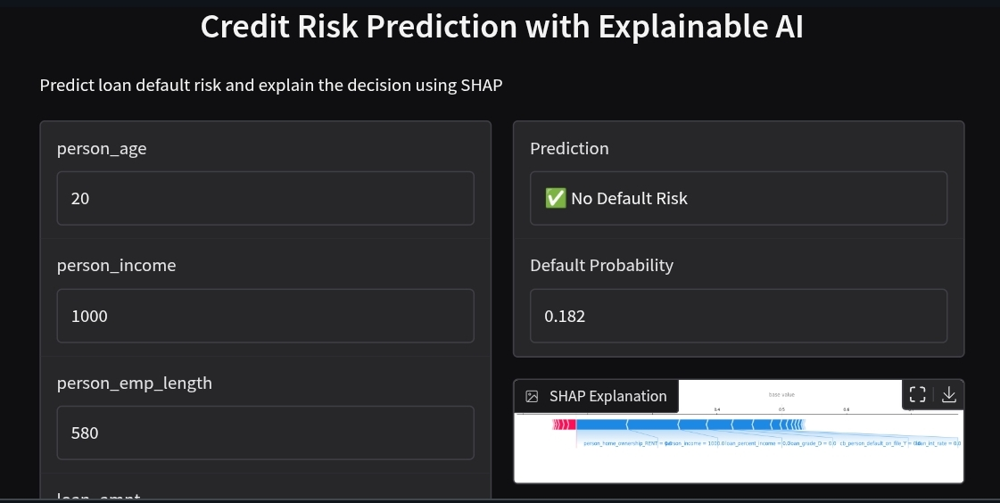

# 💳 Credit Risk Prediction with Explainable AI (XAI)

## 📌 Project Overview
This project builds an **end-to-end Credit Risk Prediction system** that predicts whether a loan applicant will **default or not** and provides **transparent explanations** using **SHAP (SHapley Additive Explanations)**.  

Unlike black-box models, this system ensures **interpretability and regulatory compliance**, which is crucial for financial institutions.

---

## 🎯 Objectives
- Predict **loan default risk**  
- Handle **class imbalance** using SMOTE  
- Train **strong ML models** (Logistic Regression & Random Forest)  
- Apply **Explainable AI (SHAP)** to interpret predictions  
- Explain **individual loan decisions**  

---

## 🗂 Project Structure
credit-risk-xai/ │ ├── data/ │   ├── raw/              # Original dataset │   └── processed/        # Cleaned & SMOTE-processed data │ ├── notebooks/ │   ├── 01_data_loading.ipynb │   ├── 02_eda.ipynb │   ├── 03_feature_engineering.ipynb │   ├── 04_modeling.ipynb │   └── 05_explainability.ipynb │ ├── models/               # Trained ML models ├── images/               # Deployment screenshots ├── reports/              # SHAP values & plots ├── README.md └── requirements.txt
Copy code

---

## 📊 Dataset
- **Source:** [Kaggle Credit Risk Dataset](https://www.kaggle.com/datasets/laotse/credit-risk-dataset)  
- **Target Variable:** `target`  
  - `0` → No Default  
  - `1` → Default  

### Key Features
- Applicant age, income, employment length  
- Loan amount, interest rate, loan intent  
- Credit history and default history  

---

## ⚙️ Methodology

### 1️⃣ Data Loading & Cleaning
- Removed invalid entries  
- Handled missing values  
- Prepared dataset for modeling  

### 2️⃣ Exploratory Data Analysis (EDA)
- Target distribution analysis  
- Feature distributions  
- Correlation analysis (numeric features only)  

### 3️⃣ Feature Engineering
- One-hot encoding for categorical variables  
- SMOTE applied to balance classes  
- Train–test split  

### 4️⃣ Modeling
- **Logistic Regression** → Baseline & interpretable  
- **Random Forest Classifier** → Strong performance  

**Evaluation Metrics:**  
Accuracy | Precision | Recall | F1-Score | ROC-AUC | Confusion Matrix  

### 5️⃣ Explainable AI (XAI)
- SHAP (SHapley Additive Explanations)  
- Global feature importance  
- Feature impact visualization  
- Individual loan decision explanations  

---

## 🔍 Explainability Examples
- **Why was a loan rejected?**  
- **Which features increased default risk?**  
- **How did income or interest rate affect the decision?**  

SHAP provides:  
- Summary plots  
- Dependence plots  
- Force plots  
- Decision plots  

---

## 🔥 Key Insights
- Loan-to-income ratio is a strong predictor of default  
- High interest rates significantly increase default risk  
- Credit history length reduces default probability  
- SHAP ensures **transparent and trustworthy decisions**  

---

## 🛠 Tech Stack
- Python  
- Pandas, NumPy  
- Scikit-learn  
- Imbalanced-learn (SMOTE)  
- SHAP  
- Matplotlib, Seaborn  
- Google Colab  

---

## 🚀 Deployment
The model is deployed using **Gradio**, allowing users to:  
- Enter loan applicant details  
- Predict default risk  
- Visualize SHAP-based explanations for transparency  

### Deployment Screenshot

---

## 🧠 How to Run
Open notebooks in Google Colab
Run notebooks in order:
Copy code

01 → 02 → 03 → 04 → 05
Optional: Launch Gradio app in Colab (05_explainability.ipynb)
📌 Use Cases
Banking & Finance
Credit Scoring Systems
Loan Approval Automation
Regulatory-compliant AI systems

👤 Author
Abraraw Ayal
Data Science Student
GitHub: https://github.com/Abre1234
LinkedIn: https://www.linkedin.com/in/Abre1234

⭐ If you like this project
Give it a ⭐ on GitHub and feel free to fork or contribute!

🔜 Next Enhancements
Deploy on Hugging Face Spaces
Generate PDF credit decision 
Add counterfactual explanations
Build interactive dashboard
